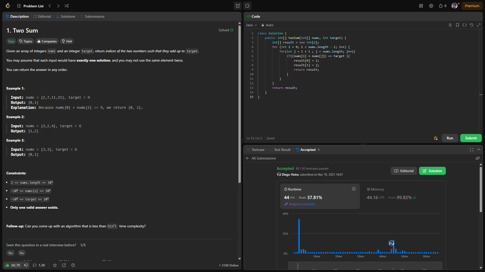

🚀 Dia 1/100: Iniciando a Jornada #100DaysOfLeetCode!

Hoje resgatei o espírito das maratonas de programação e dei o primeiro passo em um desafio pessoal: resolver 1 problema do LeetCode por dia, durante 100 dias. E nada melhor que começar com o clássico "Two Sum"!

🔍 Por que esse projeto?

Melhorar minha lógica de programação de forma consistente
Dominar estruturas de dados e algoritmos
Preparar-me para desafios técnicos em entrevistas
Compartilhar aprendizados com a comunidade
Relembrar dos tempos em que participava de maratonas de programação na faculdade

💡 Sobre o Two Sum:

Adotei uma abordagem "brute force" com dois loops aninhados. Apesar de não ser a mais otimizada (O(n²) em complexidade de tempo), foi valioso começar com uma solução intuitiva para entender o problema na prática.

🌟 Reflexão do Dia 1:

A importância de começar, mesmo com soluções simples
Entender o problema profundamente antes de otimizar
Já identifiquei oportunidades para evoluir (como hashmaps futuramente!)

📌 Para quem se identifica:
Se você também está estudando para entrevistas, aprimorando habilidades em algoritmos ou buscando disciplina em projetos de código, vamos trocar ideias!

👉 Acompanhe a jornada:
Seguirei compartilhando insights e códigos. Se quiser ver minha solução do Day 1 ou sugerir próximos desafios, comente abaixo!

Link para o desafio: https://leetcode.com/problems/two-sum/

#100DaysOfLeetCode #DataStructures #Algorithms #CodingJourney #ContinuousLearning

